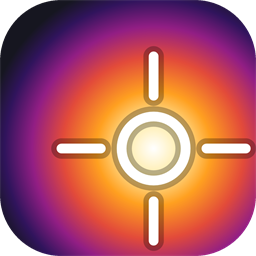
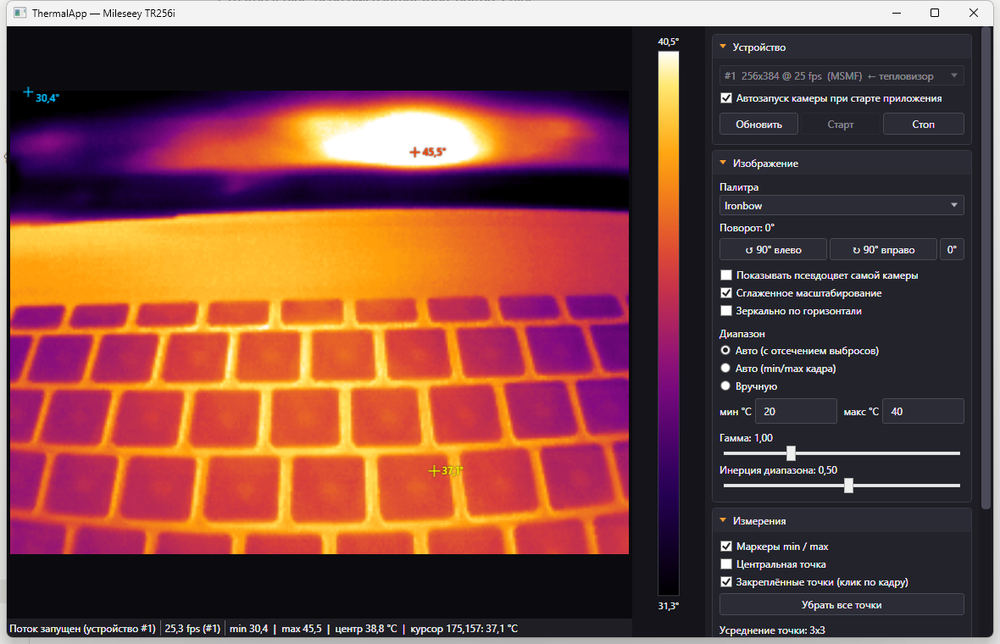

# ThermalApp

[](https://github.com/Am6er/ThermalApp/actions/workflows/build.yml)
[](https://github.com/Am6er/ThermalApp/releases)

Приложение для Windows под USB-тепловизор **Mileseey TR256i** (256×192,
`USB\VID_0BDA&PID_5840`). Живое тепловое видео, температура в любой точке кадра,
свои палитры поверх сырых 16-битных данных, снимки и запись видео вместе с
радиометрией, управление самой камерой через vendor-команды.

WPF, .NET 9, OpenCvSharp для захвата, LibUsbDotNet для vendor-команд.



## Возможности

- живой поток 256×192 @ 25 fps с разбором сырой радиометрии;
- температура под курсором, min / max / центр кадра, до 12 закреплённых точек
  с настраиваемым окном усреднения;
- 10 палитр, которые считаются у нас из сырых данных: авто-диапазон с отсечением
  выбросов, чистый min/max, ручные границы, гамма, инерция диапазона;
- поворот картинки шагами по 90° в обе стороны и зеркало — маркеры, клики и
  сохранение подстраиваются под ориентацию;
- снимок в четыре файла (PNG с метками, PNG без меток, `.r16`, CSV) и запись
  `.mp4` одновременно с `.r16`;
- vendor-команды камеры: палитра, эмиссивность, дистанция, температуры отражения
  и воздуха, переключение gain, чтение серийника и версии прошивки;
- панель для произвольных vendor-команд, чтобы копать недокументированное;
- всё состояние интерфейса запоминается в `settings.json` рядом с exe;
- подсказки при наведении на каждое поле.

## Что это за камера

TR256i — ребрендинг модуля **InfiRay Tiny1-C**. Тот же модуль стоит в
InfiRay P2 Pro, Topdon TC001, HTI HT-203U, Victor 328B. Протокол давно
отреверсен, декомпилировать APK не нужно.

### Видеопоток

Камера — обычное UVC-устройство. Отдаёт кадр **256×384 YUY2 @ 25 fps**:

| Часть кадра | Содержимое |
|---|---|
| строки 0…191 | псевдоцветная картинка в YUY2 (её рисует сама камера) |
| строки 192…383 | сырая радиометрия: 256×192 значений `uint16` little-endian |

Температура: **`T(°C) = raw / 64 − 273.15`**

### Особенности захвата на Windows

Самая скользкая часть, найдена экспериментально на этой камере
(Windows 11, OpenCvSharp 4.13):

* бэкенд **обязательно Media Foundation** (`VideoCaptureAPIs.MSMF`).
  DirectShow всегда конвертирует поток в BGR и **игнорирует
  `CAP_PROP_CONVERT_RGB`** — сырая радиометрия при этом теряется полностью;
* порядок вызовов важен: сначала `CONVERT_RGB = 0`, **потом**
  `FRAME_WIDTH = 256` и `FRAME_HEIGHT = 384`. Если размер не задать, MSMF
  отдаёт чёрный кадр (`00 80 00 80 …`);
* `FOURCC` задавать **не надо** — это ломает переговоры о формате;
* при успехе `Mat` приходит как `1 × 196608` `CV_8UC1` — ровно сырой кадр;
* первые 1–2 секунды после открытия потока модуль отдаёт заглушку, где все
  отсчёты равны `0x8000` (те самые «238.85 °C»). Такие кадры отбрасываются
  по признаку `RawMin == RawMax`.

### Vendor-команды

Управление идёт не через UVC, а через USB vendor control transfers на
интерфейсе 0 (протокол отреверсен LeoDJ в проекте P2Pro-Viewer):

| Операция | bmRequestType | bRequest | wValue | wIndex |
|---|---|---|---|---|
| запись команды | `0x41` | `0x45` | `0x78` | `0x1d00` / `0x9d00` |
| запись данных | `0x41` | `0x45` | `0x78` | `0x1d08` / `0x9d08` |
| чтение | `0xC1` | `0x44` | `0x78` | `0x1d08` / `0x1d10` |
| опрос готовности | `0xC1` | `0x44` | `0x78` | `0x0200` |

Коды команд: `pseudo_color = 0x8409`, `prop_tpd_params = 0x8514`,
`get_device_info = 0x8405`, `cur_vtemp = 0x8b0d`, `shutter_vtemp = 0x840c`,
`y16_preview_start = 0x010a`. Флаг записи — `| 0x4000`.

Параметры `prop_tpd_params`: дистанция (1/163.835 м), температура отражения (K),
температура атмосферы (K), излучательная способность (1/127), пропускание
(1/127), выбор усиления (0 = low gain / широкий диапазон, 1 = high gain).

## Скачать

Готовая сборка лежит в [Releases](https://github.com/Am6er/ThermalApp/releases):
предрелиз **latest** пересобирается автоматически при каждом коммите в `main`,
а теги `vX.Y.Z` дают обычные версионные релизы.

Нужен только [.NET 9 Desktop Runtime](https://dotnet.microsoft.com/download/dotnet/9.0)
— сборка не self-contained.

## Сборка и запуск

Нужен .NET 9 SDK.

```powershell
git clone https://github.com/Am6er/ThermalApp.git
cd ThermalApp
dotnet build -c Release
.\src\ThermalApp\bin\x64\Release\net9.0-windows\ThermalApp.exe
```

Приём кадров и все измерения работают сразу, без дополнительной настройки.

## Vendor-команды: подготовка

Чтобы менять настройки внутри камеры, нужны два шага.

1. Положить рядом с exe `libusb-1.0.dll`:

   ```powershell
   pwsh -File tools\get-libusb.ps1 -Configuration Release
   ```

2. Установить libusb-фильтр на интерфейс камеры через
   [Zadig](https://zadig.akeo.ie/):
   *Options → List all devices* → выбрать **USB Camera (Interface 0)** → в
   выпадающем списке выбрать **libusb-win32** → **Install Filter Driver**.
   Фильтр не ломает работу камеры как UVC-устройства.

Порядок в приложении: сначала «Старт» (видеопоток), потом «Подключить
управление» — иначе вызов libusb может зависнуть.

## Настройки

Всё состояние интерфейса хранится в **`settings.json` рядом с exe**, поэтому
конфиг переезжает вместе с папкой приложения. Пишется автоматически: через 1.5 с
после последнего изменения и при закрытии окна.

Запоминается: выбранное устройство захвата и галочка «Автозапуск камеры при
старте приложения», палитра, угол поворота, зеркало, режим и границы диапазона,
гамма, инерция диапазона, размер усреднения точки, какие маркеры показывать,
сами закреплённые точки, параметры камеры (ε, дистанция, температуры отражения и
воздуха, gain), какие секции панели свёрнуты, а также размер и положение окна.

Если папка приложения только для чтения, сохранение молча пропускается, а
причина выводится в строке состояния. Чтобы сбросить настройки — удалите
`settings.json`.

## Диагностика

`ThermalApp.Probe` — консольная утилита, которой удобно проверять камеру
и подбирать параметры захвата на другом железе.

```powershell
cd src\ThermalApp.Probe\bin\x64\Release\net9.0-windows

.\ThermalApp.Probe.exe                   # список устройств + 25 кадров со статистикой
.\ThermalApp.Probe.exe --device 1 --frames 100
.\ThermalApp.Probe.exe --usb             # плюс проверка vendor-команд
.\ThermalApp.Probe.exe --save out        # сохранить кадр в out.r16 / out.csv
.\ThermalApp.Probe.exe --probe2          # подбор рабочего бэкенда и порядка set-вызовов
.\ThermalApp.Probe.exe --dump C:\tmp\d   # дамп сырых буферов для всех бэкендов
```

## Форматы файлов

Снимок сохраняется в `Документы\ThermalApp` четырьмя файлами:

* `*.png` — то, что видно на экране, вместе с маркерами;
* `*_raw.png` — чистая картинка без наложений;
* `*.r16` — сырая радиометрия (см. ниже);
* `*.csv` — температуры в °C, разделитель `;`.

Формат `.r16` (заголовок 32 байта, затем кадры):

```
0   "TRAW"
4   uint16 version = 1
6   uint16 width  = 256
8   uint16 height = 192
10  uint16 flags
12  int64  frameCount
20  12 байт резерв
--- на каждый кадр:
    int64 DateTime.Ticks
    width*height*2 байта uint16 LE
```

Сырые данные и CSV всегда пишутся в исходной ориентации 256×192, чтобы не
зависеть от настроек отображения.

## Структура

```
src/ThermalApp/
  Core/ThermalFrame.cs        кадр: сырые отсчёты, статистика, перевод в °C
  Core/ThermalCapture.cs      UVC-захват через MSMF и разбор кадра 256×384
  Core/Palettes.cs            палитры (Ironbow, Rainbow, Lava, Arctic, …)
  Core/FrameRenderer.cs       раскраска raw16 -> BGRA, диапазоны, гамма
  Device/CameraControl.cs     vendor-команды через libusb
  Recording/RadiometryFile.cs формат .r16 + экспорт CSV
  Recording/Recorder.cs       запись .mp4 + параллельно .r16
  Settings/AppSettings.cs     settings.json рядом с exe
  Ui/Hint.cs                  описания элементов в строке внизу окна
  MainWindow.xaml(.cs)        интерфейс
  App.xaml                    тёмная тема, свои шаблоны контролов

src/ThermalApp.Probe/         консольная диагностика
tools/get-libusb.ps1          скачивание libusb-1.0.dll
tools/make-icon.ps1           генератор appicon.ico и docs/icon.png
```

Подсказок-тултипов нет: описание элемента под курсором показывается в строке
внизу окна — не перекрывает интерфейс и не исчезает по таймеру. Текст задаётся
в XAML через `ui:Hint.Text`.

## Что ещё не сделано

* Принудительный триггер шторки (NUC) — код команды нигде не отреверсен.
  В панели «Ручная команда» можно экспериментировать с произвольными cmd/param.
* Просмотр записанных `.r16` внутри приложения (читалка в API уже есть:
  `RadiometryFile.ReadFrames`).

## Источники

* [LeoDJ/P2Pro-Viewer](https://github.com/LeoDJ/P2Pro-Viewer) — реверс vendor-протокола
* [leswright1977/PyThermalCamera](https://github.com/leswright1977/PyThermalCamera) — разбор кадра и формула температуры
* [92es/Thermal-Camera-Redux](https://github.com/92es/Thermal-Camera-Redux)
* [Список совместимых камер](https://gist.github.com/marcelrv/e81253c14053bcd78753554df1230dd3) — TR256i указан как клон P2 Pro
